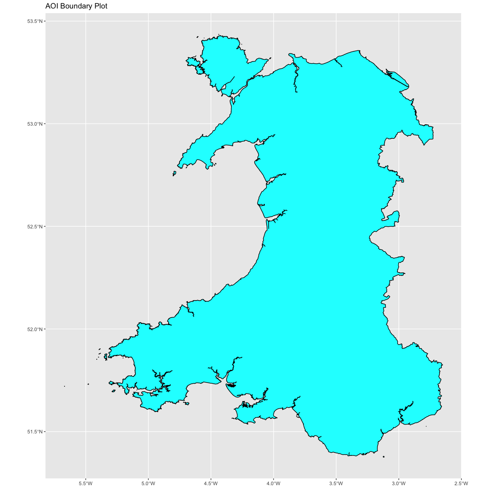

Llan Distribution
================

## Load Packages

``` r
library(sf)
```

    ## Linking to GEOS 3.9.1, GDAL 3.2.3, PROJ 7.2.1; sf_use_s2() is TRUE

``` r
library(raster)
```

    ## Loading required package: sp

``` r
library(tidyverse)
```

    ## ── Attaching packages ─────────────────────────────────────── tidyverse 1.3.1 ──

    ## ✓ ggplot2 3.3.5     ✓ purrr   0.3.4
    ## ✓ tibble  3.1.6     ✓ dplyr   1.0.8
    ## ✓ tidyr   1.2.0     ✓ stringr 1.4.0
    ## ✓ readr   2.1.2     ✓ forcats 0.5.1

    ## ── Conflicts ────────────────────────────────────────── tidyverse_conflicts() ──
    ## x tidyr::extract() masks raster::extract()
    ## x dplyr::filter()  masks stats::filter()
    ## x dplyr::lag()     masks stats::lag()
    ## x dplyr::select()  masks raster::select()

## Load data

``` r
Shape <- st_read('Data/NUTS_Level_1_(January_2018)_Boundaries/NUTS_Level_1_(January_2018)_Boundaries.shp')
```

    ## Reading layer `NUTS_Level_1_(January_2018)_Boundaries' from data source 
    ##   `/Users/louiscaruana/My Drive/3 Code/GitHub/Llan-Distribution/Data/NUTS_Level_1_(January_2018)_Boundaries/NUTS_Level_1_(January_2018)_Boundaries.shp' 
    ##   using driver `ESRI Shapefile'
    ## Simple feature collection with 12 features and 9 fields
    ## Geometry type: MULTIPOLYGON
    ## Dimension:     XY
    ## Bounding box:  xmin: -69.6978 ymin: 5342.7 xmax: 655644.8 ymax: 1220302
    ## Projected CRS: OSGB 1936 / British National Grid

``` r
Wales <- Shape[Shape$objectid %in% c('10'), ]
```

``` r
ggplot() + 
  geom_sf(data = Wales, size = 0.5, color = "black", fill = "cyan1") + 
  ggtitle("AOI Boundary Plot") + 
  coord_sf(crs = st_crs(4326))
```

<!-- -->
